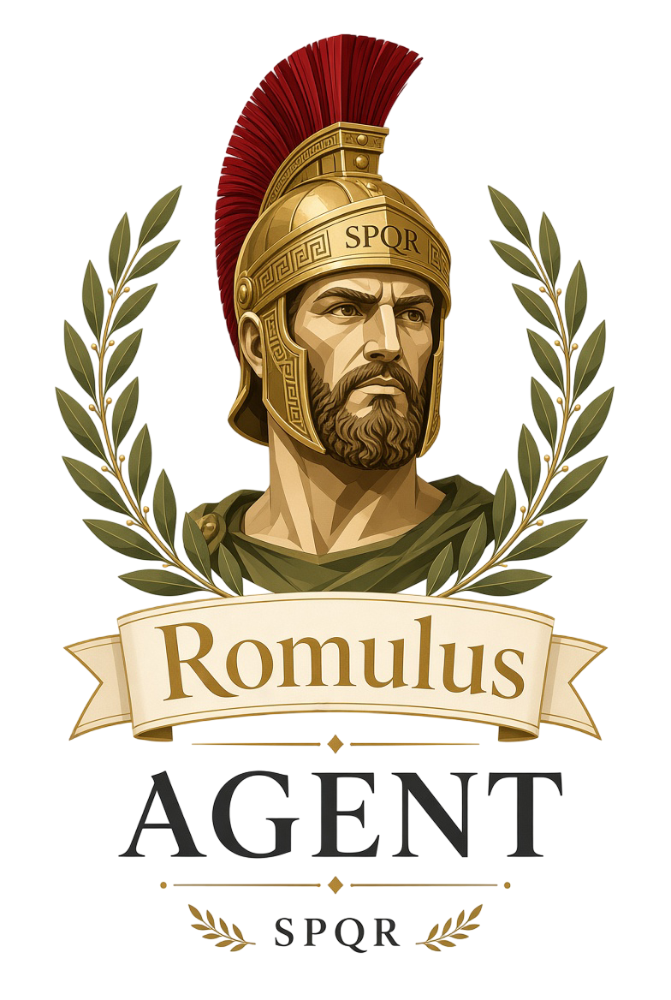

# Romulus Agent 🦅

  
  

  <a href="https://romulus-agent.com/">Romulus Agent</a> | <a href="https://romulus-agent.com/">Romulus 桌面版</a>

  
  
  
  
  
  
  

> [!IMPORTANT]
> **重要提示：** 这是 Hermes Agent 开发过程中的一个非官方分支（*fork*）。
---

  <small>为 <a href="https://romulus-agent.com">Romulus Agent</a> 精心打造 • 采用 MIT 许可证分发</small>

